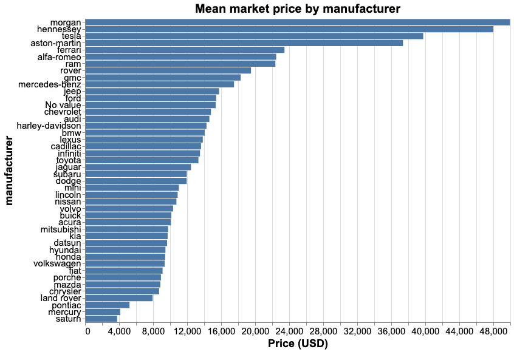
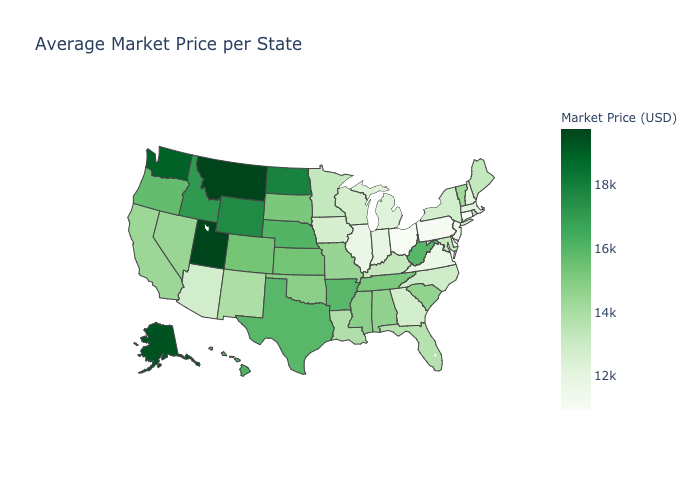

Predicting Used Car Prices
================
Andrés Pitta, Braden Tam, Serhiy Pokrovskyy  
2020/01/25 (updated: 2020-02-08)

# Summary

In this project we attempt to build a regression model which can predict
the price of used cars based on numerous features of the car. We tested
the following models: support vector machine regression, stochastic
gradient descent regression, linear regression, K-nearest neighbour
regression as well as random forest regression and gradient boosted
trees. We found that support vector machine regression shown the best
results, producing an  score of 0.877 on the training set, 0.832 on the validation set
and 0.829 on the test set. The training and validation scores are
computed from a very small subset of the data while the test score used
a much larger subset. Given that the dataset was imbalanced by
manufacturers, this led to a bit worse prediction of the classes that
were quite sparse because the model was not able to learn enough about
those classes in order to give good predictions on unseen data.

# Introduction

Websites such as Craigslist, Kijiji, and eBay have tons of users that
create a wide array of used good markets. Typically people looking to
save some money use these website to purchase second hand items. The
problem with these websites is that the user determines the price of
their used good. This can either be a good or bad thing, depending on
whether or not the user is trying to scam the buyer or give the buyer a
good deal. For the average individual who is not familiar with prices of
the used market, it is especially difficult to gauge what the price of a
used good should be. Being able to predict used car prices based on data
on a whole market will gives users the ability to evaluate whether a
used car listing is consistent with the market so that they know they
are not getting ripped off.

# Methods

## Data

The data set used in this project is “Used Cars Dataset” created by
Austin Reese. It was collected from Kaggle.com (Reese 2020) and can be
found
[here](https://www.kaggle.com/austinreese/craigslist-carstrucks-data).
This data consists of used car listings in the US scraped from
Craigslist that contains information such as listed price, manufacturer,
model, listed condition, fuel type, odometer, type of car, and which
state it’s being sold in.

## Analysis

The R and Python programming languages (R Core Team 2019; Van Rossum and
Drake 2009) and the following R and Python packages were used to perform
the analysis: docopt (de Jonge 2018), knitr (Xie 2014), tidyverse
(Wickham et al. 2019), readr (Wickham, Hester, and Francois 2018) docopt
(Keleshev 2014), altair (VanderPlas et al. 2018), plotly (Inc. 2015),
selenium (SeleniumHQ 2020), pandas (McKinney 2010), numpy (Oliphant
2006), statsmodel (Seabold and Perktold 2010). scikit-learn (Buitinck et
al. 2013).

The code used to perform the analysis and create this report can be
found [here](https://github.com/UBC-MDS/DSCI_522_Group-308_Used-Cars)

As it was mentioned, our original data holds half a million observations
with a few dozen features, most categorical, so accurate feature
selection and model selection were extremely important. Especially
because model training took significant amount of computational
resources.

Since we could not efficiently use automated feature selection like RFE
or FFE (because of time / resources constraint), we had to perform
manual feature selection. As we had some intuition in the target area as
well as some practical experience, we were able to prune our feature
list to just 12 most important on our opinion:

  - 10 categorical features:
      - manufacturer (brand)
      - transmission type
      - fuel type
      - paint color
      - number of cylinders
      - drive type (AWD / FWD / RWD)
      - size
      - condition
      - title\_status
      - state
  - 2 continuous features:
      - year
      - odometer

The following plots are just a few examples of us visual representations
of what variables seem to be important in predicting used car prices.
The code used to generate these plots can be found
[here](https://github.com/UBC-MDS/DSCI_522_Group-308_Used-Cars/blob/master/scripts/eda.py).

For hyper-paramter tuning of each model we performed a
5-fold-cross-validated grid search involving a range of the most
important model-specific hyper-parameters. We chose to use 5-folds
because we have a lot of data to work with so this amount would provide
an optimal trade-off between computational time and finding the most
unbiased estimates of our models.

# Results & Discussion

Based on our EDA and assumptions, we picked a number of models to fit
our train data. Since training and validating took a lot of resources,
we performed it on a gradually increasing subsets of training data in
the hopes that we find an optimal amount of required data for maximal
performance. The metric used to evaluate our model is
, which is a
value from 0 to 1 that gives the proportions of the variance in price
that is explained by our model. See the results below, sorted by
validation
score:

<table class="table" style="width: auto !important; margin-left: auto; margin-right: auto;">

<thead>

<tr>

<th style="text-align:left;">

Model

</th>

<th style="text-align:right;">

Train Score

</th>

<th style="text-align:right;">

Validation Score

</th>

</tr>

</thead>

<tbody>

<tr>

<td style="text-align:left;">

SVR

</td>

<td style="text-align:right;">

0.877

</td>

<td style="text-align:right;">

0.832

</td>

</tr>

<tr>

<td style="text-align:left;">

RandomForestRegressor

</td>

<td style="text-align:right;">

0.953

</td>

<td style="text-align:right;">

0.821

</td>

</tr>

<tr>

<td style="text-align:left;">

LGBMRegressor

</td>

<td style="text-align:right;">

0.852

</td>

<td style="text-align:right;">

0.816

</td>

</tr>

<tr>

<td style="text-align:left;">

XGBRegressor

</td>

<td style="text-align:right;">

0.807

</td>

<td style="text-align:right;">

0.789

</td>

</tr>

<tr>

<td style="text-align:left;">

KNeighborsRegressor

</td>

<td style="text-align:right;">

0.726

</td>

<td style="text-align:right;">

0.718

</td>

</tr>

<tr>

<td style="text-align:left;">

LinearRegression

</td>

<td style="text-align:right;">

0.549

</td>

<td style="text-align:right;">

0.520

</td>

</tr>

</tbody>

</table>

Since SVM shown the best results from the very beginning, we performed a
thorough adaptive grid search on more training data (200,000
observations, running for 4 hours) to devise a more robust model.
Finally, we ran the model on the **test data** containing more than
40,000 observations, which confirmed the model with an
 value of
**0.816**. The good sign was also that it did not overfit greatly on
train set, which was a good sign to perform further testing.

Later, we ran model testing on full training dataset taking around 12
hours, and got similar but even better results:

| Metric                                                   | Value   |
| -------------------------------------------------------- | ------- |
|  | 0.829   |
| RMSE                                                     | 4144.58 |
| MAE                                                      | 2557.73 |

Here is a list of test examples showing the predicted used car
prices:

<table class="table" style="width: auto !important; margin-left: auto; margin-right: auto;">

<thead>

<tr>

<th style="text-align:right;">

Year

</th>

<th style="text-align:right;">

Odometer

</th>

<th style="text-align:left;">

Manufacturer

</th>

<th style="text-align:left;">

Condition

</th>

<th style="text-align:right;">

Price (USD)

</th>

<th style="text-align:right;">

Prediction

</th>

<th style="text-align:right;">

Absolute Error (%)

</th>

</tr>

</thead>

<tbody>

<tr>

<td style="text-align:right;">

2015

</td>

<td style="text-align:right;">

56264

</td>

<td style="text-align:left;">

ford

</td>

<td style="text-align:left;">

No value

</td>

<td style="text-align:right;">

20123

</td>

<td style="text-align:right;">

19151.31

</td>

<td style="text-align:right;">

4.83

</td>

</tr>

<tr>

<td style="text-align:right;">

2013

</td>

<td style="text-align:right;">

96838

</td>

<td style="text-align:left;">

bmw

</td>

<td style="text-align:left;">

excellent

</td>

<td style="text-align:right;">

11499

</td>

<td style="text-align:right;">

11286.24

</td>

<td style="text-align:right;">

1.85

</td>

</tr>

<tr>

<td style="text-align:right;">

2018

</td>

<td style="text-align:right;">

14623

</td>

<td style="text-align:left;">

ford

</td>

<td style="text-align:left;">

No value

</td>

<td style="text-align:right;">

31750

</td>

<td style="text-align:right;">

31659.10

</td>

<td style="text-align:right;">

0.29

</td>

</tr>

<tr>

<td style="text-align:right;">

2011

</td>

<td style="text-align:right;">

83560

</td>

<td style="text-align:left;">

mazda

</td>

<td style="text-align:left;">

No value

</td>

<td style="text-align:right;">

7250

</td>

<td style="text-align:right;">

10754.96

</td>

<td style="text-align:right;">

48.34

</td>

</tr>

<tr>

<td style="text-align:right;">

2014

</td>

<td style="text-align:right;">

74050

</td>

<td style="text-align:left;">

ford

</td>

<td style="text-align:left;">

good

</td>

<td style="text-align:right;">

7900

</td>

<td style="text-align:right;">

9636.40

</td>

<td style="text-align:right;">

21.98

</td>

</tr>

<tr>

<td style="text-align:right;">

2000

</td>

<td style="text-align:right;">

74203

</td>

<td style="text-align:left;">

chevrolet

</td>

<td style="text-align:left;">

good

</td>

<td style="text-align:right;">

8000

</td>

<td style="text-align:right;">

6225.54

</td>

<td style="text-align:right;">

22.18

</td>

</tr>

<tr>

<td style="text-align:right;">

2007

</td>

<td style="text-align:right;">

170000

</td>

<td style="text-align:left;">

subaru

</td>

<td style="text-align:left;">

No value

</td>

<td style="text-align:right;">

3900

</td>

<td style="text-align:right;">

4980.66

</td>

<td style="text-align:right;">

27.71

</td>

</tr>

<tr>

<td style="text-align:right;">

2017

</td>

<td style="text-align:right;">

7

</td>

<td style="text-align:left;">

No value

</td>

<td style="text-align:left;">

like new

</td>

<td style="text-align:right;">

13245

</td>

<td style="text-align:right;">

16042.90

</td>

<td style="text-align:right;">

21.12

</td>

</tr>

<tr>

<td style="text-align:right;">

2004

</td>

<td style="text-align:right;">

135407

</td>

<td style="text-align:left;">

honda

</td>

<td style="text-align:left;">

excellent

</td>

<td style="text-align:right;">

4995

</td>

<td style="text-align:right;">

3780.03

</td>

<td style="text-align:right;">

24.32

</td>

</tr>

<tr>

<td style="text-align:right;">

2014

</td>

<td style="text-align:right;">

89925

</td>

<td style="text-align:left;">

audi

</td>

<td style="text-align:left;">

No value

</td>

<td style="text-align:right;">

13699

</td>

<td style="text-align:right;">

14000.42

</td>

<td style="text-align:right;">

2.20

</td>

</tr>

</tbody>

</table>

# Further Directions

To further imrpove the  of this model we can aleviate the problem of imbalanced classes
by grouping manufacturers by region (American, Germnan, Italian,
Japanese, British, etc.) and status type (luxery vs economy).

Although we achieved a solid
 value of 0.829,
we can now observe some other metrics. Eg., having an RMSE (4144.58)
almost twice higher than MAE (2557.73) suggests that there is a good
number of observations where the error is big (the more RMSE differs
from MAE, the higher is the variance). This is something we may want to
improve by finding features and clusters in data space that introduce
more variance in the predictions. Eg. the model predicting clean car
price may greatly differ from the model predicting salvage (damage /
total loss) car price. This comes from getting deeper expertise in the
area, and we will try to play with this further more.

We may also want to use a different scoring function for our model - eg.
some custom implementation of MSE of relative error, since we have high
variance of price in the original dataset.

Previously, we ran it on half of the training data which took us around
4 hours to train and resulted in 0.816 score. We were now able to run it
on a full training dataset (taking approximately 12 hours), which
improved the score by 0.013 (not much for such a big increase in
training time, but still an improvement)

The ultimate end goal is to eventually create a command-line tool for
the end-user to interactively request vehicle details and output
expected price with a confidence interval.

# References

Buitinck, Lars, Gilles Louppe, Mathieu Blondel, Fabian Pedregosa,
Andreas Mueller, Olivier Grisel, Vlad Niculae, et al. 2013. “API Design
for Machine Learning Software: Experiences from the Scikit-Learn
Project.” In *ECML Pkdd Workshop: Languages for Data Mining and Machine
Learning*, 108–22.

de Jonge, Edwin. 2018. *Docopt: Command-Line Interface Specification
Language*. <https://CRAN.R-project.org/package=docopt>.

Inc., Plotly Technologies. 2015. “Collaborative Data Science.” Montreal,
QC: Plotly Technologies Inc. 2015. <https://plot.ly>.

Keleshev, Vladimir. 2014. *Docopt: Command-Line Interface Description
Language*. <https://github.com/docopt/docopt>.

McKinney, Wes. 2010. “Data Structures for Statistical Computing in
Python.” In *Proceedings of the 9th Python in Science Conference*,
edited by Stéfan van der Walt and Jarrod Millman, 51–56.

Oliphant, Travis E. 2006. *A Guide to Numpy*. Vol. 1. Trelgol Publishing
USA.

R Core Team. 2019. *R: A Language and Environment for Statistical
Computing*. Vienna, Austria: R Foundation for Statistical Computing.
<https://www.R-project.org/>.

Reese, Austin. 2020. “Used Cars Dataset.” *Kaggle*.
<https://www.kaggle.com/austinreese/craigslist-carstrucks-data>.

Seabold, Skipper, and Josef Perktold. 2010. “Statsmodels: Econometric
and Statistical Modeling with Python.” In *9th Python in Science
Conference*.

SeleniumHQ. 2020. “SeleniumHQ/Selenium.” *GitHub*.
<https://github.com/SeleniumHQ/selenium>.

VanderPlas, Jacob, Brian Granger, Jeffrey Heer, Dominik Moritz, Kanit
Wongsuphasawat, Arvind Satyanarayan, Eitan Lees, Ilia Timofeev, Ben
Welsh, and Scott Sievert. 2018. “Altair: Interactive Statistical
Visualizations for Python.” *Journal of Open Source Software*, December.
The Open Journal. <https://doi.org/10.21105/joss.01057>.

Van Rossum, Guido, and Fred L. Drake. 2009. *Python 3 Reference Manual*.
Scotts Valley, CA: CreateSpace.

Wickham, Hadley, Mara Averick, Jennifer Bryan, Winston Chang, Lucy
D’Agostino McGowan, Romain François, Garrett Grolemund, et al. 2019.
“Welcome to the tidyverse.” *Journal of Open Source Software* 4 (43):
1686. <https://doi.org/10.21105/joss.01686>.

Wickham, Hadley, Jim Hester, and Romain Francois. 2018. *Readr: Read
Rectangular Text Data*. <https://CRAN.R-project.org/package=readr>.

Xie, Yihui. 2014. “Knitr: A Comprehensive Tool for Reproducible Research
in R.” In *Implementing Reproducible Computational Research*, edited by
Victoria Stodden, Friedrich Leisch, and Roger D. Peng. Chapman;
Hall/CRC. <http://www.crcpress.com/product/isbn/9781466561595>.

